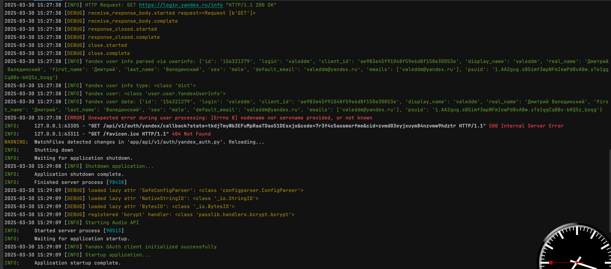

# audio-api
FastAPI service for audio file uploads with Yandex user authentication and local storage. Built with FastAPI, SQLAlchemy, and Docker. Supports secure file storage and user management.

Приложение для загрузки аудиофайлов с возможной авторизацией как через яндекс, так и по собственному эндпоинту.
Авторизация на яндексе пройдена, необходимы технические работы по проверке взаимодействия двух моделей авторизации,
кастомному логгеру, реализации загрузки аудио. Принципиально вопрос двойной авторизации решен.
Объем работ вышел за рамки установленного дедлайна 48 часов.
Качество на усмотрение ревьюера. Нужен дополнительный рефактор - срок для завершения 20 - 30 часов.

Текущее состояние уже исправлено:

Авторизация Яндекс отлично работает, данные пользователя созраняются в БД.
Дополнительно указывается способ авторизации (Яндекс, приложение).

Логирование полностью настроено

Модель авторизации позволяет администратору настраивать индивидуальный доступ к каждому эндпоинту
для каждого пользователя (использована схема tiangolo 'scopes')

Образец загруженного файла в папке "/storage".
